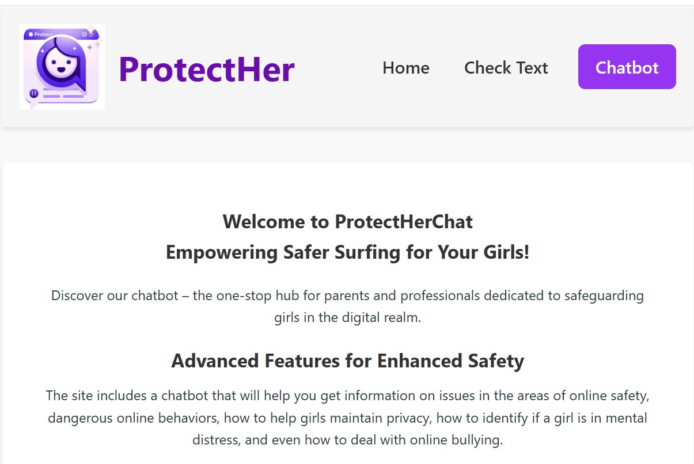
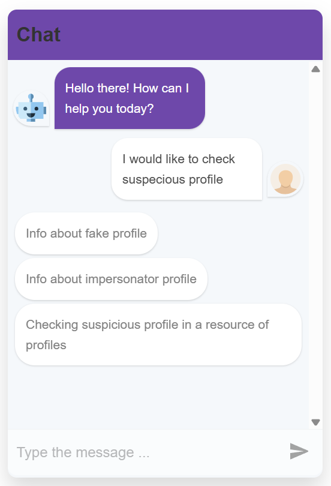
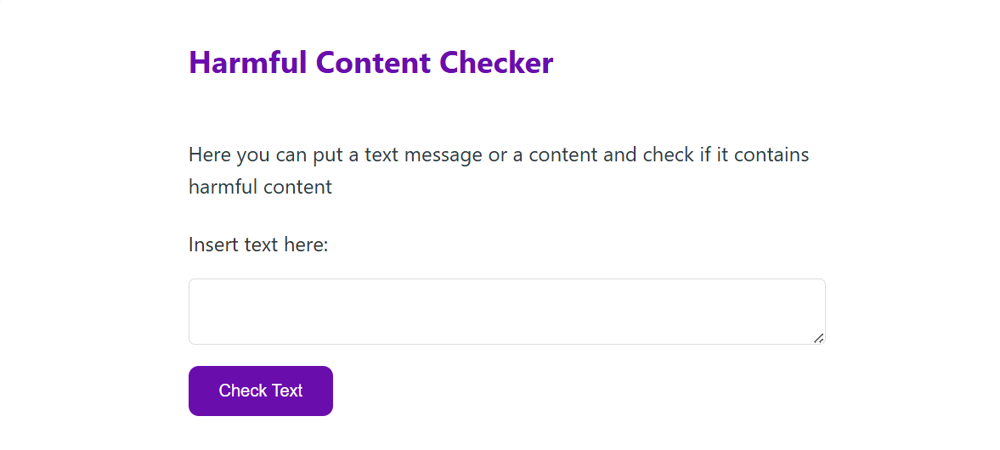

# Protect Her Chat-Full-Stack React Web Application 

## Overview
This project developed during a hackathon 2024 at AppsFlyer .
The application provides parents with vital information on the dangers their children may face online.



## Features
- 🔍 Real-time detection of harmful and dangerous words in chat  
- 🤖 Interactive chatbot that guides parents about online threats
  
  
  
👨‍👩‍👧 Target audience: Parents who want to protect their children online
  
The client side is built using **React**, while the server side uses **Next.js**. 

## External API Integration
The backend integrates with the **OpenAI API** to analyze chat messages.  
When a user submits a message, the system sends it to the API with a custom prompt asking whether the text is harmful.  
The response ("yes" or "no") is then returned to the frontend and displayed to the parent.  



## Technologies
- **Frontend**: React
- **Backend**: Next.js
- **Database**: JSON (mock storage for hackathon demo)  
- **API Integration**: OpenAI GPT  
- **Tools**: GitHub, VS Code

## Installation

### Prerequisites
Ensure you have the following installed:
- Node.js

### Setup Instructions
Clone the repository:
   ```bash
   git clone https://github.com/Gavri8827/ProtectHerChat.git
   cd your-repo
   ```
     
## Usage
Once the servers are running, you can access the application in your browser:

- **Frontend**: [http://localhost:3000](http://localhost:3000)


